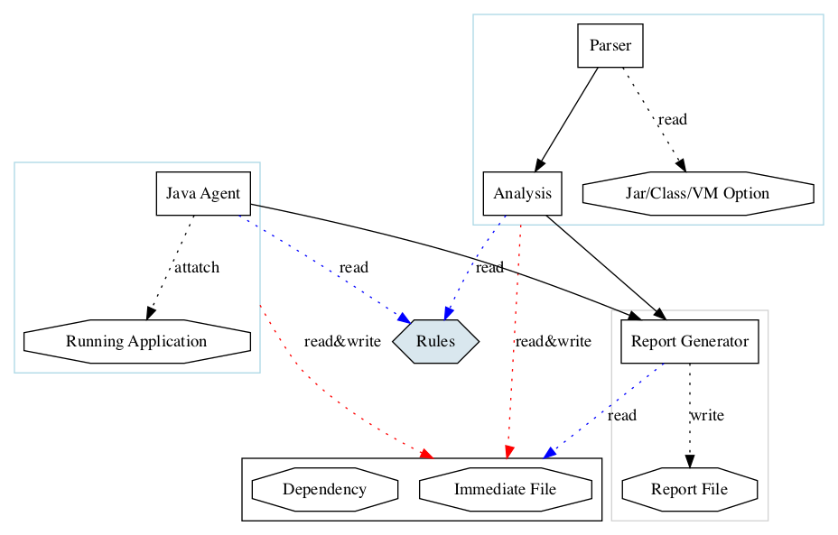

<!--
    Copyright (c) 2022 Contributors to the Eclipse Foundation

    See the NOTICE file(s) distributed with this work for additional
    information regarding copyright ownership.

    This program and the accompanying materials are made available under the
    terms of the Apache License, Version 2.0 which is available at
    https://www.apache.org/licenses/LICENSE-2.0.

    Unless required by applicable law or agreed to in writing, software
    distributed under the License is distributed on an "AS IS" BASIS,
    WITHOUT WARRANTIES OR CONDITIONS OF ANY KIND, either express or implied.
    See the License for the specific language governing permissions and
    limitations under the License.

    SPDX-License-Identifier: Apache-2.0
 -->
# Eclipse Migration Toolkit for Java(EMT4J)

The goal of EMT4J is to simplify the migration of Java applications from 
previous versions of OpenJDK, especially those deemed as Long-Term-Support (LTS)
release versions. That is:
 - 8 -> 11
 - 8 -> 17
 - 11 ->17

This migration toolkit supports examining application artifacts statically, 
including project source directories and applications archives, or running as a 
dynamic agent for runtime detection. Finally, the toolkit can produce the 
analysis results in different formats, including a raw TEXT file, JSON file, 
or HTML report highlighting areas that need changes for migration.

## Download 
[Releases](https://github.com/adoptium/emt4j/releases)

## Use the EMT4J agent
Attach the EMT4J agent jar in the command line to your target application:
For example: 
- From JDK 11 to JDK 17
```
java -javaagent:/path/to/emt4j-agent-jdk11-0.1.jar=to=17
```

- From JDK 8 to JDK 11, set the output file to `/tmp/jdk8to11.dat` 
```
java -javaagent:/path/to/emt4j-agent-jdk8-0.1.jar=file=/tmp/jdk8to11.dat,to=11
```

The emt4j-agent records possible incompatible problems to a binary file(*.dat) in the current 
working directory while running the target application. You can further analyze 
to generate the HTML report at `/path/to/report/8to11-report.html`.
```
sh bin/analysis.sh -o /path/to/report/8to11-report.html /path/to/emt4j-20220102100012.dat
```
Agent options:
* `file` : the output file path.Default file pattern: `emt4j-${yyyyMMddHHmmss}.dat` in the current working directory.
* `to` : the target JDK version you are willing to upgrade to 
(11/17 supported)
* `priority` : specify the minimum rule priority, e.g. `p2` will only enable the rule with p1 or p2 priority, default is no limit

## Use the command-line tool(statically scan)
The EMT4J can statically scan class or jar files, and the directories containing 
jars or classes for migration issues detection. After the scanning,  it writes out the final HTML report.
For example:

- From JDK 8 to JDK 11, check all jars in `/home/admin/tocheck1/lib` and classes in `/home/admin/tocheck2/classes`, report file save at `/home/admin/jdk8to11.html`
```shell script
sh bin/analysis.sh -f 8 -t 11 -o /home/admin/jdk8to11.html /home/admin/tocheck1/lib /home/admin/tocheck2/classes 
```
- From JDK 8 to JDK 17, check a single jar at '/home/admin/tocheck1/lib/foo.jar', the report file format is JSON.
```shell script
sh bin/analysis.sh -f 8 -t 17 -p JSON -o /home/admin/jdk8to11.json /home/admin/tocheck1/lib/foo.jar 
```
- From JDK 8 to JDK 11, set target JDK home, integrate JDK built-in tools to find more potential problems.
```shell script
sh bin/analysis.sh -f 8 -t 11 -j /Library/Java/JavaVirtualMachines/jdk-11.0.9.jdk/Contents/Home /home/admin/tocheck1/lib
```
- Check JVM option.
```shell script
sh bin/analysis.sh -f 8 -t 17 /home/admin/tocheck/jvm.cfg
```

All command-line options:
* `-f` : the base JDK version (8/11 supported).
* `-t` : the target JDK version you are willing to migrate to (11/17 supported).
* `-priority` : specify the minimum rule priority, e.g. `-priority p2` will only enable the rule with p1 or p2 priority, default is no limit
* `-p` : the report format, TXT, HTML (default), JSON are supported.
* `-o` : the output file name (the default name is 'report')
* `-j` : the target JDK home. The emt4j integrates the output of JDK built-in tools: jdeprscan and jdeps. The 'jdeprscan' scans a jar file or a class for uses of deprecated API. The 'jdeps' scans a jar file or a class for uses of internal API.  
* `-v` : the verbose output.

## Use it as Maven Plugin
Add the following configuration to pom.xml.
```
    <plugin>
        <groupId>org.eclipse.emt4j</groupId>
        <artifactId>emt4j-maven-plugin</artifactId>
        <version>0.1</version>
        <executions>
            <execution>
                <phase>process-classes</phase>
                <goals>
                    <goal>check</goal>
                </goals>
            </execution>
        </executions>
        <configuration>
            <fromVersion>8</fromVersion>
            <toVersion>17</toVersion>
            <targetJdkHome>/Library/Java/JavaVirtualMachines/jdk-17.0.1.jdk/Contents/Home</targetJdkHome>
        </configuration>
    </plugin>
```
The plugin will be called after the "compile" phase.

Maven plugin options:
* `fromVersion` : the base JDK version (8/11 supported).
* `toVersion`  : the target JDK version you are willing to migrate to (11/17 supported).
* `priority` : specify the minimum rule priority, e.g. `p2` will only enable the rule with p1 or p2 priority, default is no limit
* `targetJdkHome` : the target JDK home. The emt4j integrates the output of JDK built-in tools.
* `excludes` : the file list to be excluded from check.
* `includes` : the file list to be included for examination(all files will be examined by default).
* `verbose` : the verbose output.

If run from command line,run the command like this:
```shell
mvn org.eclipse.emt4j:emt4j-maven-plugin:0.2:check  -DfromVersion=8 -DtoVersion=11 -DprojectBuildDir=/home/admin/app/libs -DoutputFile=/home/admin/report.html -DoutputFormat=html
```
# Development Guide
## Preparation
### Main workflow

### How to Build
1. To build emt4j successfully, need install both JDK 8 and JDK 11.
2. Configure JDK 8 and JDK 11 in toolchains.xml of Maven,this is a sample file:
```xml
<?xml version="1.0" encoding="UTF-8"?>
<toolchains>
    <!-- JDK toolchains -->
    <toolchain>
        <type>jdk</type>
        <provides>
            <version>8</version>
            <vendor>openjdk</vendor>
        </provides>
        <configuration>
            <jdkHome>/Library/Java/JavaVirtualMachines/jdk1.8.0_281.jdk/Contents/Home</jdkHome>
        </configuration>
    </toolchain>
    <toolchain>
        <type>jdk</type>
        <provides>
            <version>11</version>
            <vendor>openjdk</vendor>
        </provides>
        <configuration>
            <jdkHome>/Library/Java/JavaVirtualMachines/jdk-11.0.9.jdk/Contents/Home</jdkHome>
        </configuration>
    </toolchain>
    <toolchain>
        <type>jdk</type>
        <provides>
            <version>17</version>
            <vendor>openjdk</vendor>
        </provides>
        <configuration>
            <jdkHome>/Library/Java/JavaVirtualMachines/jdk-17.0.1.jdk/Contents/Home</jdkHome>
        </configuration>
    </toolchain>
</toolchains>
```
3. Run with: 
```
mvn clean package -Prelease
```
4. After that the emt4j-${version}.zip will be generated at emt4j-assembly/target.

### How to run the system integration test cases
```
mvn clean verify -Ptest
```
## Modify an existing rule
### Incompatible jar
1. Open "incompatible_jar.cfg" in "emt4j-common" module.
2. The "incompatible_jar.cfg" is a CSV file, the first column is the artifact name, and the second column is the rule that describes which version can work.
3. If you need to customize the description for the jar in the final report file, you need to add a resource file:
    1. The resource file should add at  "emt4j-common/src/main/resources/default/i18n"
    2. Add a new resource bundle named "INCOMPATIBLE_JAR_${name}", the "${name}" is the artifact name in step 2.
    3. Each resource always contains these keys: "title", "description", and "solution".
3. Re-build emt4j.
### Other rules
Each rule contains these parts:
1. Rule description in "emt4j-common/src/main/resources/default/rule/11to17/rule.xml" or "emt4j-common/src/main/resources/default/rule/8to11/rule.xml".
2. (Optional) Rule data file which contains information needed by the rule implementation.
3. Rule implementation file.
4. Resource bundle for the error code of the rule.

For example, the "jvm-option" rule, the data file is "jvmoptions.cfg", the result code is "VM_OPTION".
If you want to add/modify/delete some options, you can modify the data file "jvmoptions.cfg".
If you want to customize the description in the report file, you can modify the resource bundle named with "VM_OPTION".
If you want to change the implementation of this rule, you can modify the implementation class "org.eclipse.emt4j.common.rule.impl.JvmOptionRule".
```xml
    <rule desc="JVM Option not compatible" type="jvm-option" jvm-option-file="jvmoptions.cfg"
          result-code="VM_OPTION" priority="p1">
        <support-modes>
            <mode>agent</mode>
            <mode>class</mode>
        </support-modes>
    </rule>
```
## Add a new rule
### Add rule description
Add a XML node "rule" in "rule.xml" which located at "emt4j-common" module.
The "rule" node contains:
1. Human-readable description that helps others understand the function of the rule.
2. Rule type used to make a connection with the implementation of the rule.
3. (Optional) Rule data file contains more information needed for the implementation.
4. The "result-code" makes a connection with the report file. Each result code contains a corresponding resource bundle with the same name.
5. The "priority" decides the sequence of check results in the report file.
6. The "support-modes" tell this rule is suitable for javaagent or static analysis.
### Add rule implementation
1. If the rule only applies with javaagent, the rule should add to the "emt4j-agent-jdk8" or "emt4j-agent-jdk11" or "emt4j-agent-common" module.
2. If the rule both applies with javaagent and class, the rule should add to "emt4j-common".
3. The rule need extend "org.eclipse.emt4j.common.rule.ExecutableRule".
4. The rule need add an annotation "org.eclipse.emt4j.common.RuleImpl".
### Rule registration
1. Agent Rule(JDK 8):  `org.eclipse.emt4j.agent.jdk8.MainAgent`
2. Agent Rule(JDK 11): `org.eclipse.emt4j.agent.jdk11.MainAgent`
3. Class Rule： `org.eclipse.emt4j.analysis.AnalysisExecutor`
### Add resource bundle
Suppose the result code is "BAR", add a new resource bundle named "BAR" at "emt4j-common/src/main/resources/default/i18n".
### Add integration test case
1. Add the test case to the "emt4j-test-jdk8" or "emt4j-test-jdk11" module.
2. The test case class name must end with "Test" and extend 'org.eclipse.emt4j.test.common.SITBaseCase', then implement the 'run' and 'verify' methods.
    1. The "run" method contains the code that has an incompatible problem.
    2. The "verify" method test if the check result matches the expected.
3. Add "org.eclipse.emt4j.test.common.TestConf" annotation for the new test case. 
